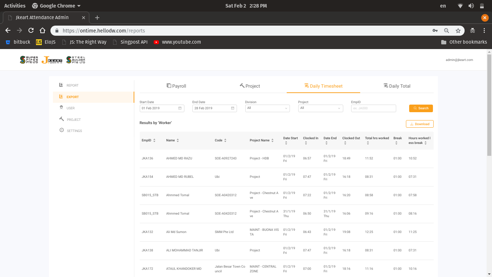

# supadech-portfolio
Supadech Premaboot ( อิฐ )'s Portfolio

## 1.Jkeart Web Admin

Time inspector web application provide admin to get the dialy reports of working hours from on-site constructors, manage projects and workers. Project design guidance is based on [Ant Design](https://ant.design/)
### Reports

### Users

### Projects

## 2.Ngee Ann Annual Report 2018

This static [website](https://www1.np.edu.sg/annualreport/2017_2018/) is powered by [Vuepress](https://vuepress.vuejs.org/) and managed by Netlify CMS.

## 3. Shopify Admin and Storefront Apps

### Working with Singapore Postal API for Shopify merchant

Order Collection application into famous eCommerce Platform called Shopify.

## 4. iPhone App + Admin web app

An iOS application for attendance and receiving reports and notifications on Leteng project, available on store [here](https://itunes.apple.com/sg/app/leteng-teamwork/id1310324388?mt=8&app=itunes&ign-mpt=uo%3D4)  This app is created from React Native. 

Also, an admin web app to manage those users who use mobile app for their attendances.

## 5. Syncing merchant products data from their owned website to Shopify.

The server is triggered after merchant uploads their data in excel format via FTP server, those data are processed into Shopify capability. Since the limited Shopify only allowing two requests per second, the challenge of this project is to upload over ten thousands of products into limited capacity. However, this is trackled by using Google Cloud and Firebase services.